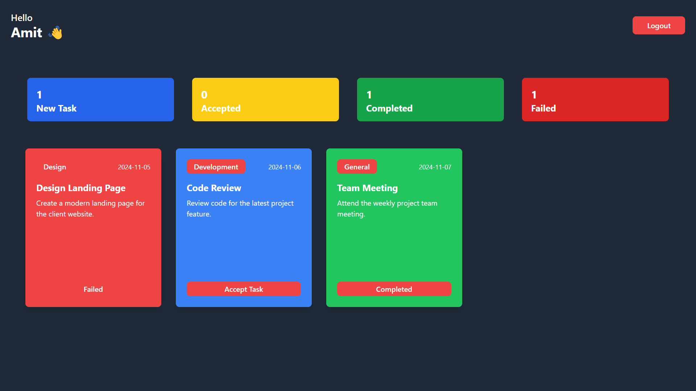

# Employee Management System (EMS)

**Deployed Site**: [Employee Management System](https://employee-management-system-byrudra.netlify.app/)

## Overview
The Employee Management System (EMS) is a React-based application that streamlines employee and task management with a modern, responsive UI. Key features include task assignment, employee tracking, real-time updates, and authentication for secure access.

## Features
- **Task Management**: Assign tasks to employees and track their status (active or completed).
- **Employee List**: View a list of employees, their task count, and activity status.
- **Real-Time Updates**: Employee data and task status are updated in real-time with local state and `localStorage` for persistence.
- **Responsive Design**: The UI adapts across devices, providing a seamless user experience.
- **Authentication**: Utilizes context-based authentication for secure access.

## Technologies Used
- **React**: For building the user interface.
- **Tailwind CSS**: For responsive, utility-first styling.
- **localStorage**: Ensures data persistence even on page reload or close.
- **JavaScript (ES6)**: Core application logic and functionality.

## Usage

### Managing Employees
- **View Employees**: The employee list shows each employee's task status and other details.
- **Assign Tasks**: Admins can assign tasks, updating statuses from "New" to "Active."
- **Task Acceptance**: Employees can accept tasks, updating their task count.

### LocalStorage Integration
The EMS leverages `localStorage` to store data persistently across sessions. If no data is found, default values are initialized.

## Key Components
- **AuthContext**: Manages global state for employees and tasks using the React Context API.
- **TaskCard**: Renders individual tasks with options for employees to accept or reject them.
- **EmployeeList**: Displays all employees along with their active task counts and details.
- **EmployeePage**: Shows a detailed view for each employee, including task history and status.

## Screenshots

1. **Login Page**

   

2. **Admin Page**

   

3. **Employee Page**

   

## Login Credentials**

   - **Admin Login**  
     - Email: `admin@me.com`
     - Password: `123`

   - **Employee Logins**
     - **Employee 1**  
       - Email: `rudra@me.com`
     - **Employee 2**  
       - Email: `employee2@me.com`
     - **Employee 3**  
       - Email: `employee3@me.com`
     - **Employee 4**  
       - Email: `employee4@me.com`
     - **Employee 5**  
       - Email: `employee5@me.com`

   *(Note: Password for all employees is `123`)*